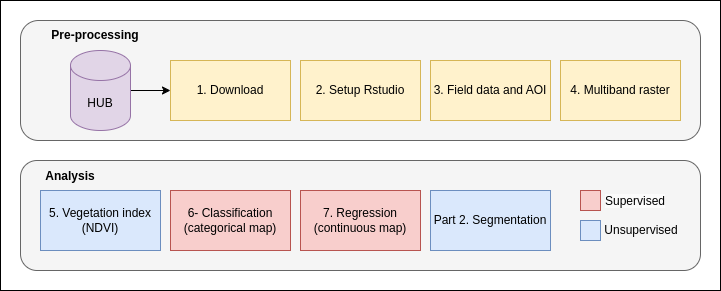

<hr style="border:3px solid gray">

# _**Part 1: Modelling and prediction of forest attributes**_

<div style="padding: 15px; border: 1px solid transparent; border-color: transparent; margin-bottom: 20px; border-radius: 4px; color: #31708f; background-color: #d9edf7; border-color: #bce8f1;">
**Goal:** Combine reference data collected in a forested area with Sentinel-2 satellite imagery to map dominant species and above-ground biomass (AGB). In this process, unsupervised and supervised approaches to analyzing categorical and continuous attributes in optical satellite imagery are explored.
</div>

**Data:** The data for the lab can be found on Y: or be downloaded from the link below. The data include a GeoPackage with field reference data of dominant species (Spruce, Pine, Broadleaves) and AGB (Mg/ha) and an area of interest polygon (AOI).

- https://drive.google.com/file/d/1K6qR8FkOzAwXew5jSavzpiJVZj5BTuLz/view?usp=sharing 

**Overview**: The figure below illustrates the steps in the lab exercise and how they relate to classification and regression methods, as well as to supervised and unsupervised approaches.




## 1. Download Sentinel-2 data 
- Download Sentinel-2 data from https://browser.dataspace.copernicus.eu/ or use the data provided in the local directory. The field inventory was carried out in summer 2022.

- "Y:/Student/Course/MINA305-h24/Course-material/02_OpticalSatelliteImagery/Sentinel2/"

In the lab report, include the \*.SAFE name on the folder. In this case: *S2B_MSIL2A_20220624T104629_N0400_R051_T32VNM_20220624T122953.SAFE*   


## 2. Rstudio 

Instructions for setting up a project in RStudio:

1. Open RStudio.
2. Create a new project.
3. Within the project directory, establish two folders: *data* (for storing data) and *R* (for housing scripts).
4. Store the geopackage and sentinel-2 files inside the *data* folder.
5. This approach ensures data file paths are relative to the \*.Rproj file, improving code readability. Please be aware that when using OneDrive, it's advisable to use the entire file path and remember to employ forward slashes ("/") instead of backslashes ("\\") to avoid potential issues.

## 3. Read and explore field reference data (vector data) 

The field reference data is stored with the GPS location coordinates (point) and can be read using the *sf* package. When using it in conjunction with the *terra* package for raster or image data, ensure that you convert it using the *vect* function.

```{r}
# Read field reference data and AOI
library(sf)
gpkg <- "data/lab2.gpkg" # Path of geopackage 
st_layers(gpkg) # List layers in geopackage
prfl <- st_read(gpkg,"SamplePlots") # Read sample plots
head(prfl) # Print the top of the data
summary(prfl) # Print a summary of the data
aoi <- st_read(gpkg,"AOI") # Read area of interest polygon
plot(st_geometry(aoi))
plot(st_geometry(prfl),add=T) #plot the geometry stored in the attribute geom 
```
## 4. Create multiband raster 

Create multiband images at 10 and 20 m resolution covering the aoi and write to disk. Functions for listing files (*dir*), *rast* and *crop* functions needed. If there are problems with downloading data (approximately 1 GB), the results from this step can be downloaded from:  https://drive.google.com/file/d/1gxk2MOXwIL1VECLGKRVN5Ho306NdyAWE/view?usp=sharing 

```{r}
library(terra)
# List files in a specific path
path <- "data/S2B_MSIL2A_20220624T104629_N0400_R051_T32VNM_20220624T122953.SAFE/GRANULE/L2A_T32VNM_A027676_20220624T104625/IMG_DATA/R10m/"
f1 <- dir(path,pattern="_B",full.names=T)
f1
# Read all files
s <- rast(f1)               
s2_10m <- crop(s,aoi) # Clip raster to aoi
names(s2_10m) <- c("Blue","Green","Red","NIR") # Rename bands
names(s2_10m) <- paste0(names(s2_10m),"_10m") # Add resolution to band, to make it unique
plotRGB(s2_10m,r=3,g=2,b=1,stretch="hist")
#writeRaster(s2_10m,"data/sentinel2_10m.tif") # Optionally write file to have access to it in GIS software

# Do the same for 20 m resolution bands 
path <- "data/S2B_MSIL2A_20220624T104629_N0400_R051_T32VNM_20220624T122953.SAFE/GRANULE/L2A_T32VNM_A027676_20220624T104625/IMG_DATA/R20m/"
f1 <- dir(path,pattern="_B",full.names=T)
s <- rast(f1)
s2_20m <- crop(s,vect(aoi))
names(s2_20m) <- c("CostalAerosol","Blue","Green","Red","RE1","RE2","RE3","SWIR1","SWIR2","RE4")
names(s2_20m) <- paste0(names(s2_20m),"_20m")
plotRGB(s2_20m,r=8,g=5,b=4,stretch="hist")
#writeRaster(s2_20m,"data/sentinel2_20m.tif")
```

### 5. Create vegetation index 

The task involves creating an NDVI raster and then exploring NDVI differences based on species, above-ground biomass (AGB), and age by assigning NDVI values to sample plots and visualizing the relationships.

1. Calculate the NDVI from your multispectral imagery (e.g., Sentinel-2) using the formula: NDVI = (NIR - Red) / (NIR + Red), where NIR is near-infrared and Red is the red band.
2. Use the *extract* function to assign ndvi values to sample plots. 
3. Explore the relationships through scatter plots of species, age, and AGB on the x-axis and NDVI on the y-axis (or employ other methods to investigate these relationships). The *ggplot2* package provides extensive and excellent plotting capabilities.


```{r}
library(ggplot2) 
# Compute NDVI and plot by Species, AGB, Age any strange observations? This can potentially be used for checking errors (e.g. harvest!)
ndvi <- (s2_10m$NIR_10m - s2_10m$Red_10m)/(s2_10m$NIR_10m + s2_10m$Red_10m) # Compute NDVI 
plot(ndvi)
e2 <- extract(ndvi,prfl) # Extraxt NDVI at sample plot locations 
prfl$ndvi <- e2[,2] # Assign extracted NDVI values to prfl (Point geometries gives a one-to-one relationship)
ggplot(prfl,aes(x=Species,y=ndvi)) + geom_boxplot() # Box plot of ndvi by species
ggplot(prfl,aes(x=Age,y=ndvi,color=Species)) + geom_point() + geom_smooth(method="lm",se=FALSE) # Scatterplot with linear regression lines 
ggplot(prfl,aes(x=AGB,y=ndvi,color=Species)) + geom_point() + geom_smooth(method="lm",se=FALSE)
```

## 6.Classification - dominant species map

We need to unify resolutions to make predictions for individual pixels. This is solved by resampling the 20 m images to 10 m and then merge them into one raster. 

```{r}
# Resample and merge 10 m and 20 m Sentinel 
s2_20m_resampled <- resample(s2_20m,s2_10m) # Resample
s2 <- c(s2_10m,s2_20m_resampled) # Merge
s2
```

We need to extract the pixel values at sample plot locations, remove possible no-data points, and prepare the data for classification. 

```{r}
# Extract RS information 
e <- extract(s2,vect(prfl))
dat <- cbind(prfl,e[-1]) # -1 for removing ID
dat <- st_drop_geometry(dat) # removing geometry

# Remove nodata points
dim(dat)
dat <- dat[is.na(dat$NIR)==FALSE,] 
dim(dat)

# Convert species to factor (categorical R variable for classification 
dat$Species <- factor(dat$Species,levels=c("Spruce","Pine","Broadleaves")) # or if you do not care about the order of species, just: as.facotr(data$Species)
```

Classifying dominant species using *randomForest* 

```{r}
# Classifiy dominant species
library(randomForest)
head(dat)
dat1 <- dat[,-c(1:4,6)] # Sub-setting species and spectral bands i.e. removing other field measured variables 
rf1 <- randomForest(Species~.,data=dat1) # The ~. indicates that I will create a classification model that use all the data in dat1 
rf1
sp <- predict(s2,rf1) # Predict on the raster file
plot(sp,col=c("darkgreen","lightblue","green")) # Make a plot 
```


## 7. Regression - above ground biomass map (AGB) 

We will use the measurements of biomass (AGB) on the sample plots to make a model used for mapping and evaluate using the Root Mean Square Error. RMSE is calculated as the square root of the mean of the squared differences between observed values ($y_i$) and predicted values ($\hat{y_i}$) for a dataset of size *n*:
$$
RMSE = \sqrt{\frac{1}{n} \sum_{i=1}^{n}(y_i - \hat{y}_i)^2}
$$
The we will make a scatter plot of the observed (y-axis) vs predicted values (fitted) (x-axis). For reasoning behind this see Piñeiro et al. (2008) [^1]. 

[^1]: Piñeiro, G., Perelman, S., Guerschman, J. P., & Paruelo, J. M. (2008). How to evaluate models: Observed vs. predicted or predicted vs. observed? Ecological Modelling, 216(3), 316–322. https://doi.org/10.1016/j.ecolmodel.2008.05.006

```{r}
# Predict AGB 
rf1 <- randomForest(AGB~.,data=dat[,-c(1:3,5:6)]) # Doing the sub-setting of the data inside the data argument of the function
rf1
agb <- predict(s2,rf1) # Predict on sentinel-2 image
plot(agb)
# fitted value for sample plots
dat$AGB_pred <- predict(rf1)
plot(dat$AGB_pred,dat$AGB,ylim=c(0,500),xlim=c(0,500))
abline(0,1)
# Compute root mean square error (RMSE)
rmse <- sqrt(mean((dat$AGB_pred-dat$AGB)^2))
# And compute it in percent relative to the mean biomass of my sample plots
rmse/mean(dat$AGB) * 100 
# Plotting predicted vs observed. 
ggplot(dat,aes(x=AGB_pred,y=AGB,color=Species)) + geom_point() + geom_abline() + coord_cartesian() + xlim(0,500)+ ylim(0,500)
```

# _**Part 2: Creating a forest mask**_

<div style="padding: 15px; border: 1px solid transparent; border-color: transparent; margin-bottom: 20px; border-radius: 4px; color: #31708f; background-color: #d9edf7; border-color: #bce8f1;">
**Goal:** The prediction maps of dominant species and AGB cover areas outside the forest and areas lacking reference data. Therefore, we need to mask out these regions. We will explore two methods to achieve this. 
</div>

We can obtain a forest mask in several ways: 
1. We can collect data covering the entire area and use classification as for species above.
2. Perform a similar analysis as in lab exercise 1 (refer to lab 1).
3. Segment the image into similar units and select the units to be included (Outline below).

## De-mystifying segmentation 

1. Generate a systematic sample.
2. Group samples based on spectral similarity using k-means clustering.
3. Predict (or more accurately, "impute") group labels from k-means to the entire image using k-nearest neighbor.
4. Apply a spatial filter to remove "salt and pepper" noise.

```{r}
library(dplyr) # Package needed for piping (%>% ) which improves code readability 
library(class) #  General classification pacakge part of core R 
set.seed(123) # I have added a seed to look the randomness that will occur in the analysis, i.e. the results will be the same next time I run the code.  
g <- st_sample(aoi,size=1000,type="regular") # Systematic sample of points
g <- st_as_sf(g) #Convert 
e3 <- extract(s2_10m,g)
obs <- na.omit(e3[,-1])

km <- kmeans(obs,centers=10) # k-means clustering. An unsupervised clustering algorithm. I selected 10 groups 

#Function need to use knn in the predict.rast function 
predfun <- function(model, data) {
  pred <- knn(obs,data,km$cluster,k=1) # I selected one neighbor 
}

knnmap <- predict(s2_10m,obs,fun=predfun) #Impute values, note that the input is data not a model
plot(knnmap)
knnmap2 <- focal(knnmap,w=7,fun="modal") # Run a focal majority filter to remove "salt and pepper" 
plot(knnmap2)
# Convert to polygons 
poly <- as.polygons(knnmap2)
poly <- st_as_sf(poly) # Step to make it in the sf class
write_sf(poly,"data/kmeans.gpkg","kmeans") 
plot(poly)
# Checking cluster codes in GIS and 
sel <- c(3,4,6,8,9,10) # My selection of means groups 
poly2 <- poly %>% filter(focal_modal %in% sel) # Select the kmeans classes that I want from the vector data to plot (not really needed)
plot(poly2)
mask <- knnmap2 %in% sel # Apply a filter to the raster data
agb_masked <- agb * mask # Remove the areas not forest and keep only forested areas. 
plot(agb_masked) 
```

```{r}
sp_masked <- sp * mask
sp_masked[sp_masked == 0] <- NA
par(mfcol=(c(1,2)))
plot(sp_masked,col=c("darkgreen","lightblue","green"),main="Classification")
plot(agb_masked,main="Regression" )

knnmap2_masked <- knnmap2 * mask
knnmap2_masked[knnmap2_masked == 0] <- NA
par(mfcol=(c(1,2)))
plot(knnmap2_masked,main="Unsupervised" )
plot(sp_masked,col=c("darkgreen","lightblue","green"),main="Supervised")
```


```{r,echo=FALSE,include=FALSE}
knitr::purl("02_LabCode_OpticalSatelliteImagery.Rmd")
```

# References 

